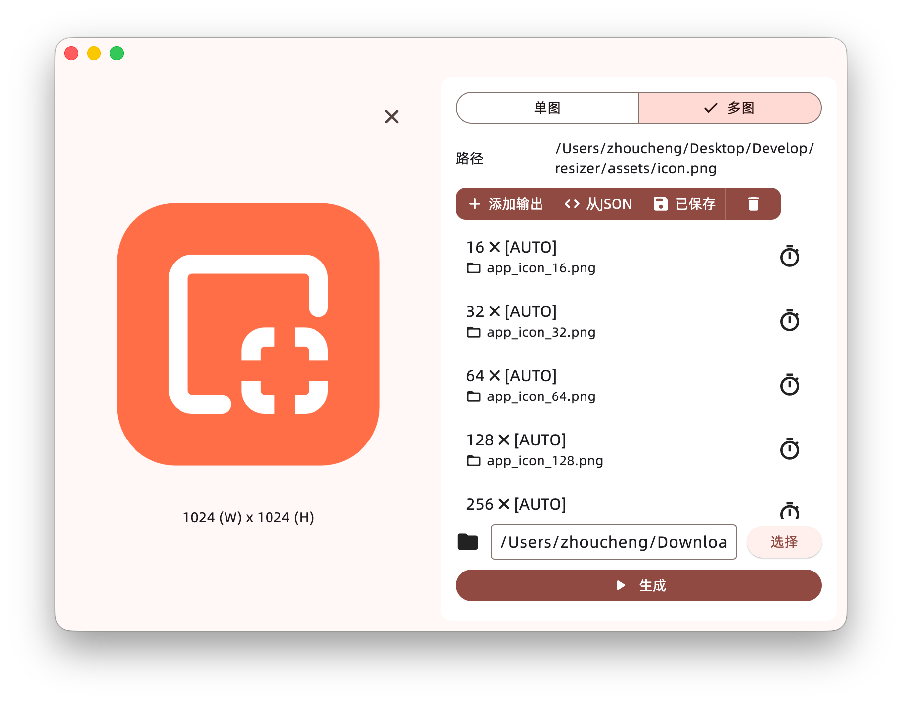

# Resizer

## Introduction


This is a tool for resizing images, supporting multiple output sizes using JSON scripts.

The core component repository is [here](https://github.com/Zhoucheng133/Resizer-Core)

## Screenshots



## Script Format

You can refer to the sample script [sample.json](../demo/sample.json)

```JSON
{
  "name": <Multi-task name>,
  "tasks": [
    {
      "path": "output.png",
      "width": <Width(pixel), 0 means auto>,
      "height": <Height(pixel), 0 means auto>
    },
    {
      "path": "output_16x16.png",
      "width": 16,
      "height": 0
    },
    // ...
  ]
}
```